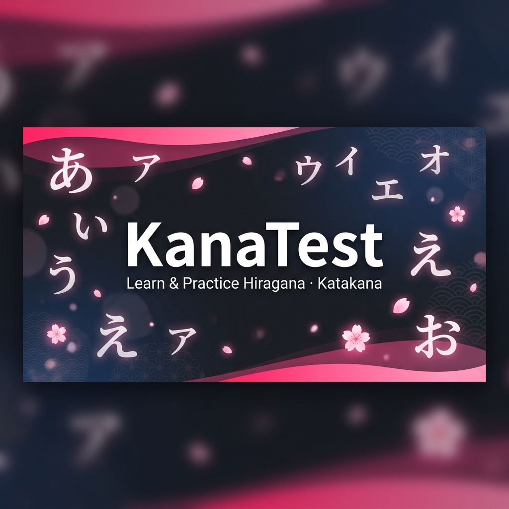

# KanaTest あ — Japanese Kana Practice

> A fully offline, zero-dependency web app for learning and testing Japanese Hiragana and Katakana.



---

## ✨ Features

### 📊 Study Mode
- Full **Hiragana** and **Katakana** tables in authentic **Gojūon order**
- Proper 5-column grid layout (あ-row, か-row, さ-row…) with correct empty cells for や/わ rows
- Covers **Basic**, **Dakuon (゛)**, **Handakuten (゜)**, and **Combination** kana
- Tab switcher: Hiragana · Katakana · Both

### 🧪 Test Mode
Cascading filter system to configure each session:

| Option | Description |
|--------|-------------|
| Simple Hiragana | Basic あいうえお… only |
| All Hiragana | Basic + selected modifiers |
| Simple Katakana | Basic アイウエオ… only |
| All Katakana | Basic + selected modifiers |
| Mixed Kana | Hiragana + Katakana combined |

**Modifier checkboxes:** Dakuon · Handakuten · Combinations · Half-width Katakana (advanced)

**Test engine:**
- One kana at a time with a large animated card
- Instant **Enter-to-submit** — no button clicks needed
- ✅ Correct → moves to next (with green flash)
- ❌ Wrong → shows the correct answer + re-queues the question near the front (you must get it right before moving on)
- Accepts common **alternate romaji spellings** (shi/si, chi/ti, tsu/tu, fu/hu, ja/zya, etc.)

### 📈 Live HUD During Test

| Chip | Meaning |
|------|---------|
| 🟢 **New** | Questions answered correctly on first attempt |
| 🟠 **Redo** | Questions currently queued for retry |
| ⚫ **Pending** | Fresh questions not yet shown |

Progress bar advances **only** when a new question is first-attempt correct.

### 🏁 Results Screen
- Total · Correct · Mistakes · Accuracy %
- Time taken (when timer mode is enabled)
- **Mistakes review grid** — shows what you typed vs. the correct answer
- Try Again · New Configuration buttons

### 📖 Reference Tables
Dedicated reference section with:
- Hiragana → Romaji (complete Gojūon)
- Katakana → Romaji (complete Gojūon)
- Dakuon transformation pairs
- Handakuten transformation pairs
- Combination kana (Hiragana + Katakana)

### 🌙 Dark Mode
- Respects system `prefers-color-scheme` on first visit
- Toggleable via the moon/sun button in the navbar
- Preference saved to `localStorage`

### 💾 Progress History
- Last 50 test results saved automatically in `localStorage`
- Stores: date, accuracy, total, correct, wrong, time

---

## 🛠️ Tech Stack

| Layer | Technology |
|-------|-----------|
| Markup | Semantic HTML5 |
| Styling | [Tailwind CSS](https://tailwindcss.com/) (CDN) + custom vanilla CSS |
| Logic | Vanilla JavaScript (ES6+, no frameworks) |
| Fonts | [Noto Sans JP](https://fonts.google.com/noto/specimen/Noto+Sans+JP) · [Inter](https://fonts.google.com/specimen/Inter) (Google Fonts) |

**No build step. No npm. No bundler.** Open `index.html` directly in any modern browser.

---

## 📁 File Structure

```
KanaTest/
├── index.html        # App shell — all sections, nav, modals
├── style.css         # Custom styles (controls, HUD chips, scrollbar, dark mode)
├── kana-data.js      # All kana data + STUDY_TABLES row definitions
├── app.js            # Full application logic (test engine, rendering, state)
├── favicon.ico       # App icon (sakura pink あ)
├── OpenGraph.webp    # Social sharing banner (1200×630)
└── README.md         # This file
```

---

## 🚀 Getting Started

No setup required. Just open the file:

```bash
# Clone or download the project
git clone https://github.com/your-username/KanaTest.git
cd KanaTest

# Open directly in browser
open index.html          # macOS
start index.html         # Windows
xdg-open index.html      # Linux
```

Or serve locally for better font loading:

```bash
# Python 3
python3 -m http.server 8080

# Node.js (npx)
npx serve .
```

Then visit `http://localhost:8080`.

---

## ⌨️ Keyboard Shortcuts

| Key | Action |
|-----|--------|
| `Enter` | Submit answer |
| `Escape` | Quit current test |

---

## 🗾 Kana Coverage

### Basic (Gojūon)
| Script | Count |
|--------|-------|
| Hiragana basic | 46 |
| Katakana basic | 46 |

### Modifiers
| Type | Hiragana | Katakana |
|------|----------|----------|
| Dakuon (゛) | 20 | 20 |
| Handakuten (゜) | 5 | 5 |
| Combinations | 33 | 33 |
| Half-width Katakana | — | 46 |

**Total pool (all options enabled): ~209 unique characters**

---

## 🎨 Design System

- **Primary colour:** Sakura pink `#ff2d72`
- **Font (UI):** Inter
- **Font (Kana):** Noto Sans JP
- **Custom scrollbar:** Frosted glass thumb with sakura pink gradient
- **Custom radio/checkbox:** Fully CSS-styled, keyboard accessible
- **Dark mode:** System-aware + manual toggle

---

## 📜 Romaji Acceptance Table

The test engine accepts the following alternate spellings:

| Kana | Primary | Also accepts |
|------|---------|--------------|
| し | shi | si |
| ち | chi | ti |
| つ | tsu | tu |
| ふ | fu | hu |
| じ | ji | zi, di |
| ず | zu | du |
| しゃ | sha | sya |
| しゅ | shu | syu |
| しょ | sho | syo |
| ちゃ | cha | tya, cya |
| ちゅ | chu | tyu, cyu |
| ちょ | cho | tyo, cyo |
| じゃ | ja | zya, jya, dya |
| じゅ | ju | zyu, jyu, dyu |
| じょ | jo | zyo, jyo, dyo |
| を | wo | o |
| ん | n | nn |

---

## 🌐 SEO

Meta tags configured for:
- `<title>` and `<meta description>`
- Open Graph (`og:title`, `og:description`, `og:image`)
- Twitter Card (`summary_large_image`)
- Keywords: *hiragana test, katakana test, practice hiragana, practice katakana*

---

## 📄 License

MIT — free to use, modify, and distribute.

---

*Built with ❤️ for Japanese learners. がんばって！*
